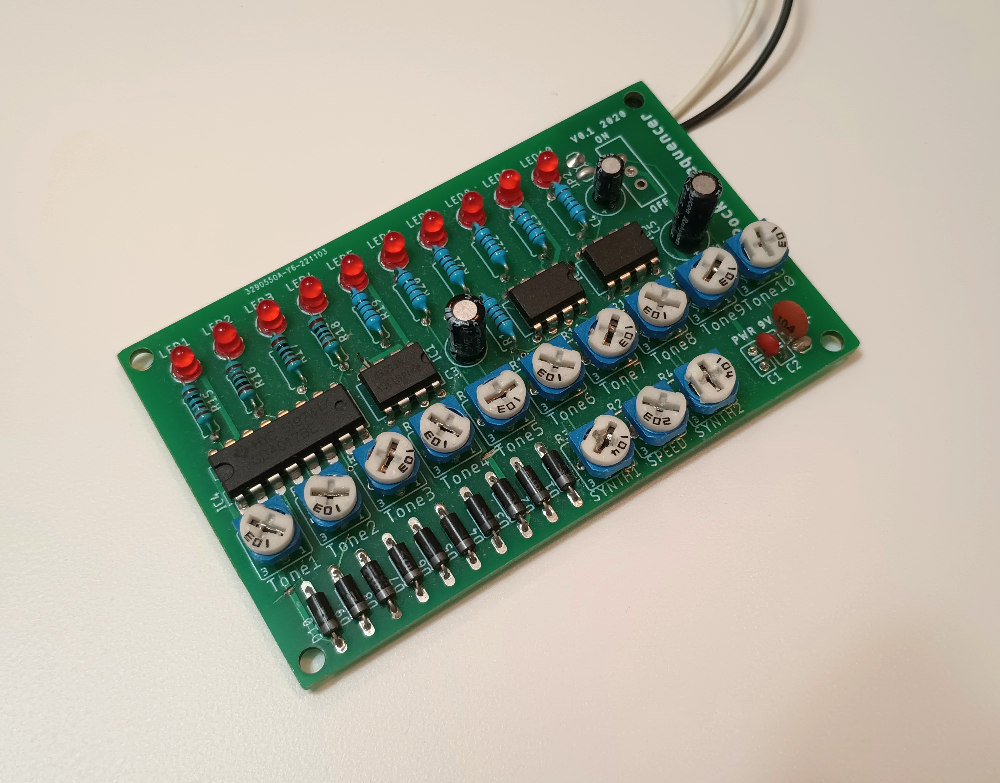

# Pocket 10‑Step Electronic Sequencer

Pocket Sequencer is a simple, hands‑on 10‑step electronic music toy built from one CD4017 decade counter and three NE555 timers. I first built this as a breadboard project in 4th grade while learning how the 4017 and 555 work. In 2020 I turned that prototype into a PCB using Eagle, and this is the result: a tiny sequencer you can carry in your pocket and play with using the trimmers.

## Features
- 10 steps (CD4017 decade counter)
- Three 555 timers:
  - Clock generator for the 4017 (astable)
  - Per‑step tone generator (astable)
  - Gate/envelope (monostable) to shape each note
- Individual tone control for each step (10 pots)
- Global speed control (clock pot)
- LED row that indicates the active step
- Runs from a 9V battery (works on ~5–16V)

## How it works (circuit overview)
- One 555 (U2) is wired as an astable clock. Its output provides clock pulses to the CD4017, advancing the active output on each pulse.
- The CD4017 activates its outputs sequentially (0 through 9). Each of these outputs controls a corresponding pot (R5–R14) that feeds the tone generator.
- A second 555 (U3) is the tone generator. The individual step pots change its timing components so each step can produce a different frequency (tone).
- The third 555 (U4) is configured as a monostable. It receives the tone output as a trigger and produces a shaped output pulse (gate) of a set duration (controlled by R4). This creates a distinct, consistent note length for each step.
- LEDs tied to the 4017 outputs indicate the current step.

Tuning R3 and R4 (the global tone/gate controls) together with the step pots produces a wide variety of sounds.

## Usage
- Power the board.
- Turn the clock speed pot (R2) to set sequence rate.
- Adjust each step pot to set the tone for that step.
- Use the global tone/gate trimmers (R3/R4) to shape the overall character and note length.
- Watch LEDs to see the active step and experiment with combinations of pot positions.

## Power
Recommended: 9V battery. The circuit will generally operate on anywhere from 5V to 16V, but be mindful of the voltage limits of the CD4017 and LEDs. If you use an external supply, make sure it is regulated and that polarity is correct.

Enjoy exploring sequences and making sounds!
